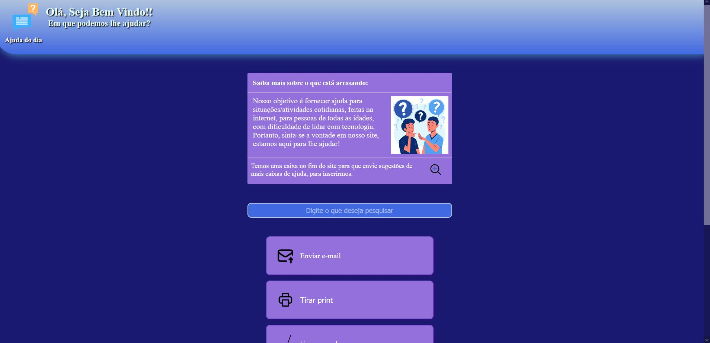

<h1 align="center">Página de ajuda</h1>

 

  <a href="#-tecnologias">Tecnologias</a>&nbsp;&nbsp;&nbsp;|&nbsp;&nbsp;&nbsp;
  <a href="#-projeto">Projeto</a>&nbsp;&nbsp;&nbsp;|&nbsp;&nbsp;&nbsp;

 

  

## 🚀 Tecnologias

Esse projeto foi desenvolvido com as seguintes tecnologias:

- HTML, CSS e JavaScript
- Git e Github

## 💻 Projeto

O intuito do projeto é uma página web para ajudar pessoas, com dificuldade em realizar atividades comuns na internet, como limpar o cache do navegador, baixar um aplicativo, entre outros. A página foi pensada como um TCC do meu curso de análise e desenvolvimento de sistema, da faculdade. 

- [Visit the project online](https://rafael-vitor-oliveira.github.io/AjudaDoDia/)